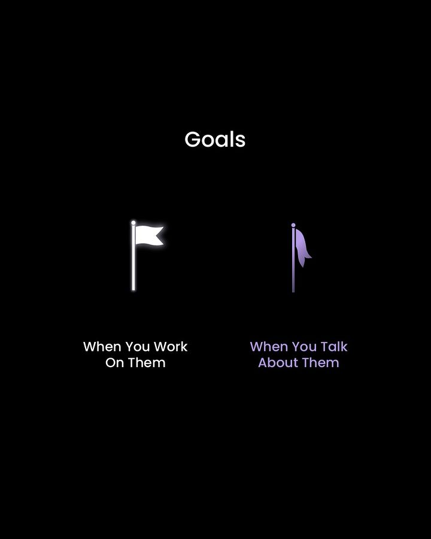

# Accountability

**We take ownership of our actions.**

<figure><figcaption>
Reference to where accountability can be present. <strong>Source:</strong> <a href="https://www.instagram.com/p/CkBGB6wspQI"><strong>@VisuallyNeeded on Instagram</strong></a>
</figcaption></figure>

What we said, what we promised.

Including our personal successes, or our mistakes.

> _"Being held accountable is an act of generosity and compassion. It is a gift that someone gives us to correct our wrongs, unlearn, and do better for the sake of our own growth. It might be uncomfortable, but it is worth the discomfort."_\
> **Minaa B.**

**We take profound responsibility** for whatever we do that could slow down or negatively affect the growth of the company, projects, other team members and our community.
